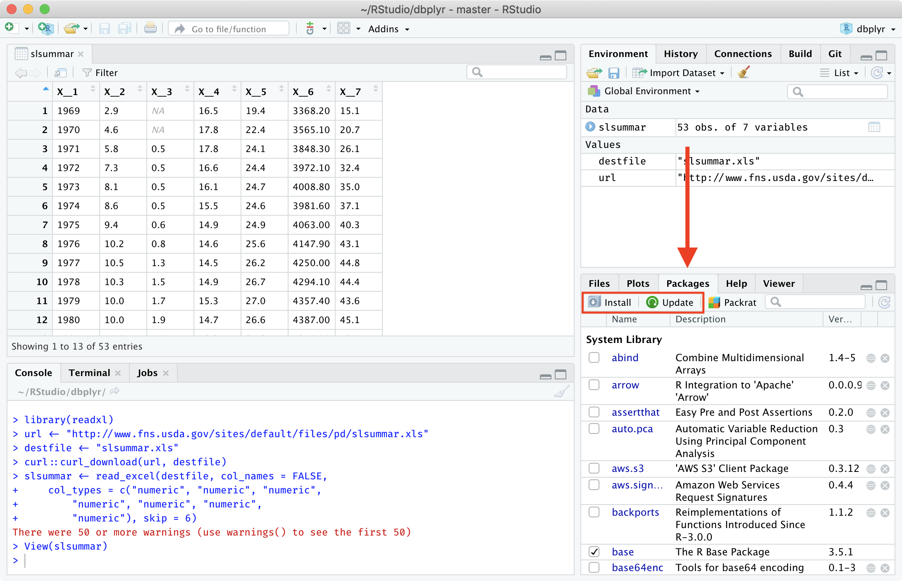
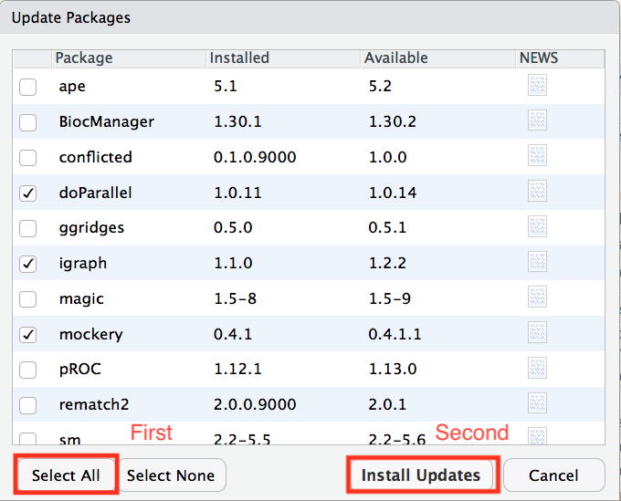
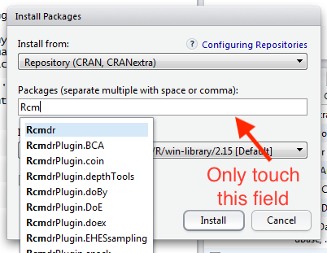
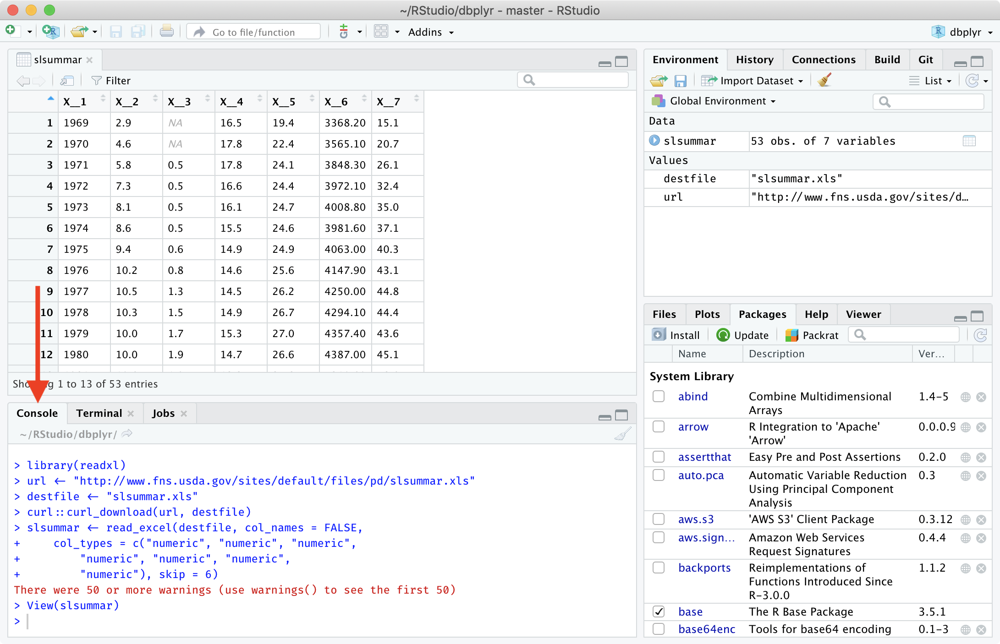
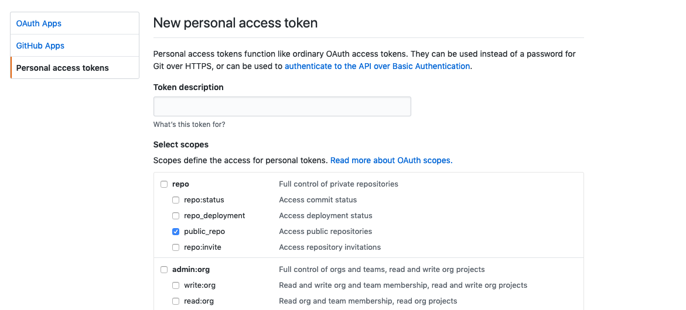

# DeclareDesign project web site - declaredesign.org

[](https://travis-ci.org/DeclareDesign/declaredesign.org)

## Setting up the build environment on macOS Mojave.

1. Install [Homebrew](https://brew.sh/).

2. [Change the default shell](https://apple.stackexchange.com/a/232983) to the latest Bash version.

3. [Install](https://apple.stackexchange.com/a/69332) the GNU versions of the shell utilities (coreutils, findutils, gnu-tar, gnu-sed, gawk, gnutls, gnu-indent, gnu-getopt, grep) and [set them as default](https://stackoverflow.com/a/16288733) on your path. An example of what the `/etc/paths` file should look like is [here](https://gist.github.com/Nick-Rivera/0d7d841ebb3aeff3e9cd556b43344459). Add the first five lines in that example file to your `/etc/paths` file.

4. Install Node, Python 3, Hugo, Pandoc, and Pandoc-citeproc with Homebrew:
`brew install node python hugo pandoc pandoc-citeproc`.

5. Make sure that you have the latest version of npm and the Python tools. Run [this](https://gist.github.com/Nick-Rivera/09426b4c773d82f78f1bd4602cdfcbd1) to update them.

6. Install R manually from [here](https://cloud.r-project.org/). Do not install R through Homebrew!

7. Install gfortran 6.1 from [here](https://cran.r-project.org/bin/macosx/tools/).

8. Install R Studio from [here](https://www.rstudio.com/products/rstudio/download/#download) to make dependency installations easier.

9. In R Studio, click on `Update` under the `Packages` tab in the bottom right window and update all the packages when prompted.





10. After that, install the following dependencies by clicking on the `Install` button (next to the `Update` button).

    - tidyverse
    - devtools
    - blogdown
    - checkpoint
    - testthat
    - diffobj
    - formatR



11. Run `devtools::install_github("Nick-Rivera/pkgdown")` in the R console and select the 3rd option when prompted.



12. Also run `devtools::install_github("tidymodels/broom")` in the R console.

13. Follow all the steps below in this README to get the Python environment set up for local building.

## How do I run the build script locally?

**Warning**: Running this script will erase blog posts in the content directory.
Make sure that you have committed them before running this script. Also, you must reset the project directory before you build the blog pages because building any of the other sections deletes the blog pages.

Steps for running locally on macOS:

First, `cd` into the declaredesign.org directory:

```sh
cd ~/Downloads/declaredesign.org
```

Then run `npm install`.

Then, get your Python environment set up in that directory:

```sh
# Update your Python packages.
python3 -m pip install --upgrade pip setuptools wheel virtualenv

# Create a new virtual environment.
virtualenv venv
source venv/bin/activate

# Install the required package for the script to run.
python3 -m pip install pyyaml

```

Next, add a GitHub Personal Access API token to the top of the file `scripts/run_build_locally.py` on the line `GITHUB_API_TOKEN = ""`. The token only needs the `public_repo` permission.



Now, run that script with Python:

```sh
python3 scripts/run_build_locally.py
```

After closing your terminal session, you will need to rerun `source venv/bin/activate` in the `declaredesign.org` directory if you want to run the build script again.
