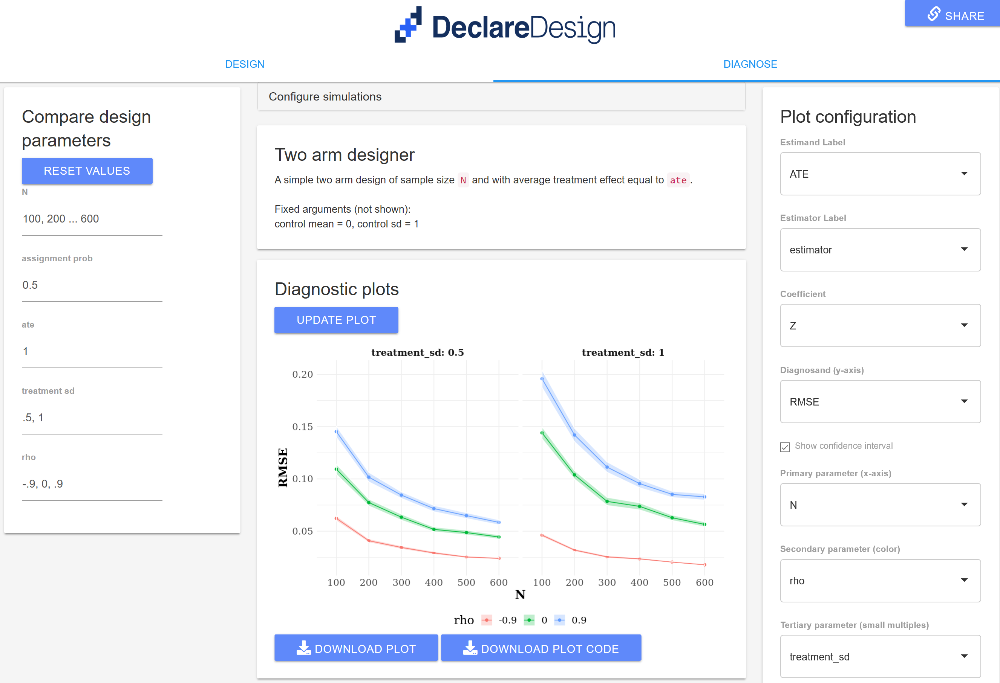

[DeclareDesign](www.declaredesign.org) is a collection of tools to help you  "declare" and "diagnose" research designs. In a word, with the DeclareDesign packages you can quickly state the core analysis-relevant features of a research design, and in return you will get a diagnosis, telling you how well your design is likely to perform and how changes in the design could improve performance. 

That's the good news. The bad news is that it's all set up in `R`. Fun for some, but a dealbreaker for many.    

Enter [DDWizard](https://eos.wzb.eu/ipi/DDWizard). DDwizard is a web interface that lets you select any design from a growing library of [DesignLibrary](https://cran.r-project.org/web/packages/DesignLibrary/DesignLibrary.pdf) templates, customize them, and interrogate them.  All without ever having to look at any code.

The wizard has a `Design` tab and a `Diagnose` tab. The `Design` tab lets you load and customize a design; the `Diagnose` tab lets you interrogate the design---generating nice plots showing how the design performs compared to other similar designs.

It's still in beta but you can already do a lot. We'd love it if you tried it out and sent us feedback to improve it (see end of post). 

To get started immediately with the simplest design, head to https://eos.wzb.eu/ipi/DDWizard/ and load the “Two Arm” design. Click over to the “diagnose” tab and select “Run diagnoses and update plot” to start learning about a very simple experiment with one treatment condition and one control condition.

# Five Things to Do with the Declare Design Wizard

Here are five things you can do with the wizard.

## 1 Create a design

The DeclareDesign library has templates ("designers") for generating many common designs. In each case a complete design usually requires specifying a model of how the world works, inquiries (estimands), data strategies (sampling and assignment) and answer strategies (estimates) (see [here](https://declaredesign.org/declare.pdf) for more detail).

Each designer in the library can make a class of designs based on the arguments you provide. The library includes simple experimental designers, as well as designers for factorial and multiarm experiments. It also has designers for observational studies, such as regression discontinuity designs or instrumental variables designs. And it even has some designers for simple qualitative studies, such as process tracing. 

Suppose for instance you were interested in a 2 by 2 factorial design. The Two by Two designer in the DesignLibrary lets you  specify the sample size, mean outcomes and standard deviations in each outcome cell, and the assignment probability for each factor (`prob A`, `prob B`). You can also specify how your estimand weights the effects across arms  (`weight A`, `weight B`). Other designers allow different arguments; in the multiarm designer for example you can specify the number of arms you have and then provide arguments related to each arm. (Click the "Read more" button for more on each designer).

Once you plug in the values you want, the design code gets written and you can start putting it to work. 

## 2. Diagnose and improve your design

For any design selected, you can use the diagnosis tab to further inspect design properties such as power, bias, and root mean squared error (RMSE), under different values of one or more parameters. Interactive graphs and tables make it easy to visualize trends and trade-offs between alternative design specifications.

As you do so you can also generate fancy figures that show off you diagnoses, varying up to three design parameters at at time. 

To generate plots:

* Provide the values you want (you can give value to any parameters that are not "fixed"--see middle panel).
* Choose the parameter to appear on the x-axis and any other parameters to be displayed in the color aesthetics (optional) or along different plots (optional). (These last two options are only available when multiple parameters are being varied in the diagnosis)
* Download the graph as .png OR download the code needed to generate the plot and the relevant data as an `.R` file. If you do this you can further tailor the design in any way you like.

<!-- https://eos.wzb.eu/ipi/DDWizard/?_state_id_=b0257f61ecfbd413 -->

## 3. Share it

Once you generate a design there are three ways to share it with others.

1. You can download the design as an `.rds` object which R speaking friends can load up.
2. You can download the code for the design and share that. That's a good option if you want to put a design declaration in a pre-analysis plan, for example.
3. You can send a link to your design. This is a cool option: Declare a design, hit the "Share" link in the top right corner, and send a colleague the URL They should be brought back to the wizard and get to a page with all your design tailoring preserved. The idea here is that even if you are an R user you might want to share your design with colleagues who are not: in this case you can point them directly to your design in a way that lets them examine and interrogate it.
 
## 4. Use it for teaching

Many designers in the Design Library let you  illustrate how design-based inferences depend on specific model assumptions. This can be useful for teaching. For example, the `Binary IV` design arguments can be defined in such a way that violates one or more assumptions for a strong instrumental variable. Similarly, the `Mediation design` lets you explore design properties under the violation of sequential ignorability and heterogeneous effects. Simulating and diagnosing such designs helps illustrate the magnitude and direction of bias and other properties when each assumption is violated separately, as well as what estimates are affected by or perform best under these scenarios.

## 5. Move beyond the library: Use the wizard package to show off and share your own designs

For more advanced R and _DeclareDesign_ users, the DDWizard can serve as an interactive interface for exploring the properties of any custom-made designer function. 

To do this locally:

1. Make a copy of the `DesignLibrary` repository [here](https://github.com/DeclareDesign/DesignLibrary)
2. Add new designer function(s) to the library in the `"R/"` directory of the package ([tips](https://declaredesign.org/library/articles/how_to_write_and_contribute_designers.html)) and rebuild the package;
3. Download or clone `DDWizard` [here](https://github.com/DeclareDesign/DDWizard) and run `shiny::runApp()` on the app directory. 

A version of the DDWizard should then run locally with new function(s) from your `DesignLibrary` appearing in the dropdown menu below `Choose design`.

Even better: you can use pull requests to  contribute your designers to the design library in which case they will automatically be available for everyone via the web app. See instructions [here](https://declaredesign.org/library/articles/how_to_write_and_contribute_designers.html)

## Feedback

The DDWizard is still under development and we want to make it better. 

* Please report issues and make feature requests via [this google form](https://docs.google.com/forms/d/e/1FAIpQLSfH8_zy14p1OgvA4Kpx1OSuqx3Kihb5f3OrxA6W_KwDFPqijA/viewform?usp=sf_link)
* Or contribute to developing the app [on our Github repository](https://github.com/DeclareDesign/DDWizard/issues)
* Or ask questions about DeclareDesign more generally on our [discussion board](http://discuss.declaredesign.org/)
